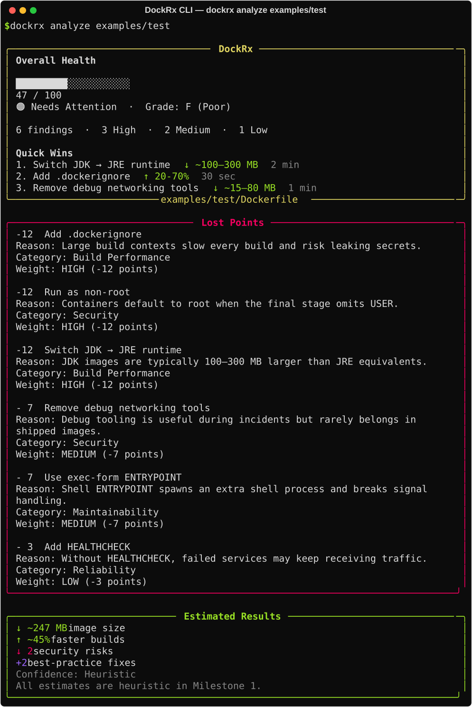

# DockRx

[](#install)
[](LICENSE)
[](#development)
[](#install)

Analyze Dockerfiles and explain performance, size, caching, and security problems with actionable fixes.

DockRx is built to answer one question well:

> How do I improve this Dockerfile?

Instead of stopping at lint-style warnings, DockRx explains impact, prioritizes quick wins, shows copy-paste fixes, and helps you compare before/after improvements.



> **Alpha note:** image-size and build-time numbers in the report are **heuristic estimates**, not measured from real builds. `dockrx fix` / `suggest` auto-fix a **subset** of rules; others are recommendations only.

## Real Example

```bash
$ dockrx analyze examples/test

Overall Health
██████████░░░░░░░░░░
52 / 100
Needs Attention · Grade: F (Poor)

Quick Wins
1. Switch JDK -> JRE runtime          ↓ ~100-300 MB   2 min
2. Add .dockerignore                  ↑ 20-70%        30 sec
3. Remove debug networking tools      ↓ ~15-80 MB     1 min

Estimated Results
↓ ~247 MB image size
↑ ~45% faster builds
↓ 2 security risks
```

## Why DockRx

- diagnosis-oriented output, not just warnings
- rule explanations via `dockrx explain`
- non-destructive fix previews via `dockrx fix` (writes `Dockerfile.fixed`)
- before/after comparison via `dockrx compare`
- extensible hybrid rule engine for teams

## Install

### From source (recommended for alpha)

```bash
git clone https://github.com/kiwi-07/docrx.git
cd dockrx
uv sync
uv run dockrx --version
```

### From PyPI

PyPI publish is coming soon for `0.1.0`. Until then, install from source as above.

```bash
# after publish:
# pip install dockrx
# pipx install dockrx
```

## Commands

```bash
dockrx analyze .
dockrx analyze Dockerfile
dockrx analyze . --json
dockrx analyze . --score-only

dockrx explain DRX018

dockrx fix . --dry-run --yes
dockrx fix . --yes
dockrx fix . --limit 5

dockrx compare before/ after/
dockrx compare before/ after/ --json

dockrx badge . --format markdown
dockrx suggest . --yes
dockrx format Dockerfile --check

dockrx --version
```

Full command reference: [`docs/commands.md`](docs/commands.md)

## How DockRx Compares to Hadolint

| Capability | DockRx | Hadolint |
|---|---|---|
| Dockerfile linting | Yes | Yes |
| Explain impact (size, cache, hardening) | Yes | Limited |
| ROI-prioritized output | Yes | No |
| Suggested fixes in output | Yes | Limited |
| Rule knowledge base (`explain`) | Yes | No |
| Non-destructive fix preview | Yes | No |
| Before/after comparison | Yes | No |
| Shell linting inside `RUN` | Limited | Strong |
| Mature production ecosystem | Early-stage | Very mature |

DockRx is not trying to replace Hadolint. Today the best pairing is:

- **Hadolint** for deep Dockerfile + shell linting
- **DockRx** for optimization, prioritization, explainability, fixes, and team-facing UX

DockRx is also **not** a CVE/vulnerability scanner.

## Features

- Hybrid rule engine: built-in YAML rules + Python plugins
- Rich terminal diagnosis with health gauge, quick wins, lost points, estimated results, treatment plan
- `dockrx explain` rule documentation
- `dockrx fix` / `suggest` — non-destructive rewrite to `Dockerfile.fixed` (subset of rules)
- `dockrx compare` before/after Dockerfile comparison
- `dockrx badge` health-grade SVG/markdown badges
- `dockrx format` Dockerfile formatter (`--check` / `--diff` safe; `--write` overwrites in place)
- JSON output for CI or automation
- Project-local rule and plugin overrides
- Configurable via `[tool.dockrx]` in `pyproject.toml`

## Built-in Rule Coverage

DockRx ships with built-in YAML rules and Python plugins covering:

- cache ordering for npm, pip, Maven, Gradle, Go, and Cargo
- package manager cache cleanup (`apt`, `apk`, `pip`, `npm`)
- runtime hardening (`USER`, secrets in `ENV`, debug tools in runtime)
- image-size reductions (JDK in runtime, large base images, build tools in final stage)
- best practices (`HEALTHCHECK`, `LABEL`, `.dockerignore`, `ADD` vs `COPY`)

## Configuration

Optional settings in your project's `pyproject.toml`:

```toml
[tool.dockrx]
log-level = "WARNING"
fail-on-severity = "HIGH"          # analyze exit 1 threshold: HIGH|MEDIUM|LOW|INFO|none
default-fix-limit = 3
health-thresholds = { excellent = 90, good = 75, fair = 60, needs-attention = 40 }
```

## JSON Output

```bash
dockrx analyze . --json
dockrx compare before/ after/ --json
```

## Roadmap

### Now

- static Dockerfile analysis
- rich terminal UX
- explain / fix / compare / badge / suggest / format
- GitHub Action + local extensibility

### Next

- PyPI publish
- image inspection / layer-size analysis
- richer auto-fix coverage
- CLI helpers to scaffold local rules

### Later

- HTML reports
- remote rule packs
- VS Code extension

Full roadmap: [`docs/roadmap.md`](docs/roadmap.md)

## Documentation

- Commands: [`docs/commands.md`](docs/commands.md)
- Extending DockRx: [`docs/extending.md`](docs/extending.md)
- Architecture and scope: [`docs/architecture.md`](docs/architecture.md)
- Roadmap: [`docs/roadmap.md`](docs/roadmap.md)
- Changelog: [`CHANGELOG.md`](CHANGELOG.md)
- Contributing: [`CONTRIBUTING.md`](CONTRIBUTING.md)

## Development

```bash
uv sync --group dev
uv run pytest
uv run ruff check src/ tests/
uv run dockrx analyze examples/bad
uv run dockrx analyze examples/good
uv run dockrx compare examples/bad examples/good
uv run dockrx fix examples/test --dry-run --yes
```

## License

Apache-2.0
